# VFA — Personal Portfolio

Personal portfolio of **Vittorio Francesco Ardente**, junior software developer and IT technician based in Dalmine (Bergamo, Italy): professional experience, education, skills and a printable CV, in Italian, English and Polish.

## Live Site

**https://vittorio-francesco-ardente.github.io/** · LinkedIn: https://www.linkedin.com/in/vittorio-ardente-812775388 · GitHub: https://github.com/Vittorio-Francesco-Ardente

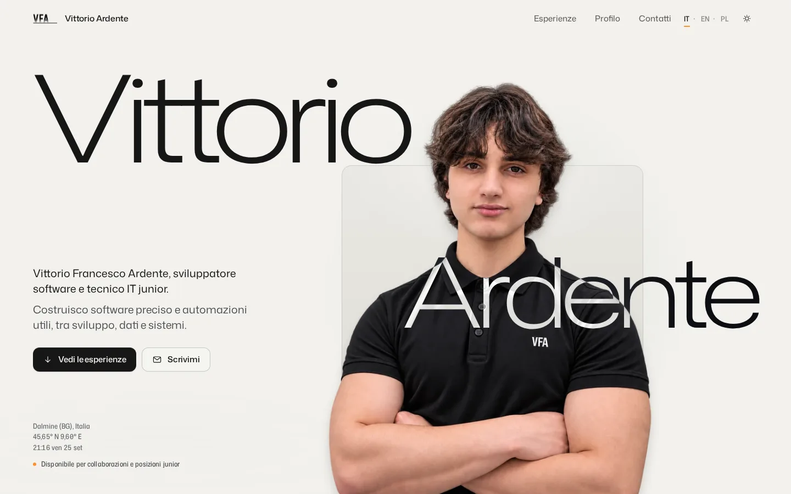

## Design Concept

An editorial, architectural layout: wide margins, a strong type hierarchy in Mona Sans, photography instead of decoration, warm mineral white / graphite / near-black surfaces and a single accent — VFA Signal Orange — reserved for what is active, current or interactive: a status LED, the current Dock item, timeline progress, focus.

The site is built on one small design system (`src/styles/global.css`):

- **Colour** — light: warm mineral paper `#F2F1ED`, secondary `#EAE9E4`, surfaces `#F8F7F4`, text `#161616`; dark: paper `#0B0C0C`, graphite `#121313` / `#151616`, warm off-white text. Never pure white on pure black. The always-dark "rooms" (bento, detail sheets) use one ladder of reliefs (`--tile` → `--room-2` → `--room-3` → `--room-4`) instead of one-off greys.
- **Type** — display (hero name, section statements: weight 290–460, tracking −0.035 to −0.05 em, line height ≈0.94–0.96), section titles, body, and uppercase micro-labels with expanded tracking.
- **Materials** — four radius tiers and nothing else: 8 (chips, fields, focus, small photos) · 12 (buttons, panels) · 18 (tiles, cards, phone bar) · 22–28 px (full-width sheets, Dock, dialogs), plus pill and circle shapes. Three shadow roles: *contact* (resting), *float* (lifted) and *drag* (picked up / closest to the viewer), with the same roles inside the dark rooms. Borders are 1 px hairlines.
- **Motion** — two curves: `cubic-bezier(.22,.8,.24,1)` for entrances, cards and sections, `cubic-bezier(.2,.7,.2,1)` for hover, press and controls. Four levels: structural (nav drop), narrative (stack spread, timeline), interactive (Dock, bento, buttons), micro (hover, focus). Theme changes cross-fade surfaces and text in 240 ms.

The page follows a deliberate rhythm, each part with its own surface and its own job:

| | Section | Role |
|---|---|---|
| 01 | Hero | **Calm** — the portrait, the name, the role, two calls to action |
| 02 | What moves me | **Immersive** — a stack of personal photographs that spreads around one sentence |
| 03 | At a glance | **Interactive** — the draggable bento grid |
| 04 | Experiences · Profile | Content |
| 05 | Journey | **Narrative** — the scroll-driven timeline |
| 06 | Questions · Contact · CV | **Functional** |

The hero portrait is always shown whole and untouched in front of a rounded panel as wide as the shoulders: only the elbows and forearms reach past its edge, which passes behind them, with a soft contact shadow on the panel. Sections change surface deliberately: the hero portrait dissolves into the same paper as the next section (nothing crosses the boundary), and the dark “At a glance” and contact bands are full-width, square-edged bands. The hero enters in sequence — name, portrait, introduction, actions, metadata — and the portrait keeps a very small parallax during the first scroll.

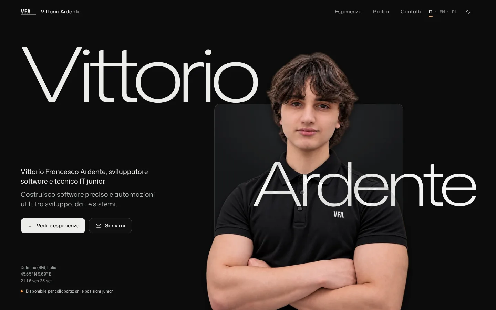

## Interaction Design

### Dock Navigation — the drop

At the top of the page there is a plain horizontal header (VFA, Experiences, Profile, Contact, IT/EN/PL, theme). As the hero scrolls away the header liquefies into a single drop that falls and becomes a physical Dock:

1. **Surface tension** (40–90 px) — the bar detaches from the page frame, narrows, its corners round and a subtle bulge forms under its centre.
2. **Formation** (90–130 px) — the surface gathers towards the Dock's width; the text labels compress and fade (language and theme last), the bulge grows.
3. **Detach** (130–160 px) — a compact capsule separates from the retracting header, slightly stretched like a drop; the VFA monogram moves into it.
4. **Fall** (160–220 px) — the drop falls on a barely curved path with a mild acceleration and a soft deceleration before the Dock position (`cubic-bezier(.45,.05,.3,1)`), scaleY slightly above scaleX.
5. **Settle** (220–250 px) — it widens into the Dock shell with a soft deceleration and no bounce; icons resolve and magnification switches on only now.

Everything is derived from one normalised scroll progress (`--nav-progress`), so fast scrolling, changes of direction, anchor jumps and resizes cannot leave it half-way, and scrolling back up plays the same motion in reverse. The shape is made of a `clip-path` surface and one drop element deformed only with `transform` — no SVG goo filters, no timers. Tablets use a shorter fall; on phones the header capsule drops a few pixels and the bottom navigation settles in its place. With reduced motion the two states simply cross-fade.

Once settled, the Dock follows the interaction model of the ibelick Dock: one pointer tracker over the whole dock measures the distance to each item; the closest grows from 44 px to about 76 px, neighbours grow proportionally (cosine falloff over 150 px), far items stay at base size, and every size follows a spring (mass 0.1, stiffness 150, damping 12). Labels appear above the icon on hover and keyboard focus; the current section has a small orange dot. Touch devices get touch-native versions: stable 46 px items on tablets, a labelled bottom bar on phones.

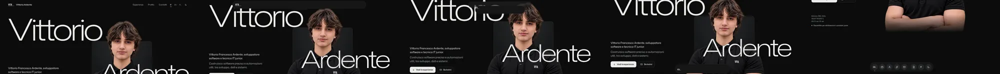

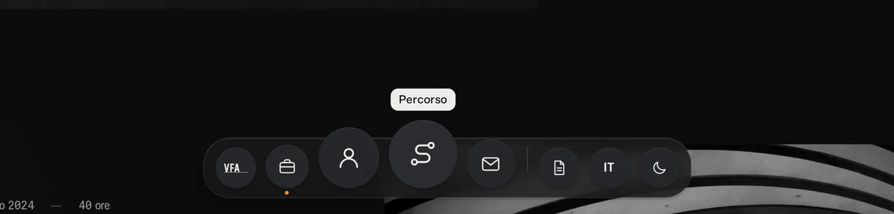

### Stack Spread — “What moves me”

A dedicated section right after the hero with one sentence and nothing else: **“Ciò che mi muove.”** (EN “What moves me.”, PL “To, co mnie napędza.”) in Mona Sans display (weight 460, tracking −0.05 em, line height 0.94; 76–122 px on desktop, 56–86 px on tablets, 40–60 px on phones). No label, no taxonomy, no counters: the photographs carry the meaning. For screen readers a visually hidden line lists what the photos show.

**Photographs.** Sixteen personal subjects, each stored locally in AVIF and WebP at two sizes (up to 1440 px for retina screens) with known dimensions: an electric guitar headstock, acoustic guitar strings, a turntable, a loudspeaker and an audio input (music); the site's own SQL code and fibre optics (technology, networks); gears and an old propeller (mechanics); a yellow Vespa (Italian mechanics and mobility); a ploughed field, wild wheat, wooden windmills and the Castelluccio plain (countryside, agriculture); the Alpe di Siusi (Italy); the Vistula at night (Poland). Desktop shows 12 of them, portrait tablets 9, phones 6. A tractor is still missing: no photograph with a clear licence was reachable, and the right one is Vittorio's own (see Development).

**Real depth.** The cards live in a perspective space (1100–1500 px, origin on the title). Each photograph has its own depth plane — about 20 % in front (+100…+180 px), 55 % in the middle, 25 % behind (−60…−160 px) — its own small rotateX / rotateY / rotateZ (most within ±3°, a few up to ±6°, some almost straight; most cards turn slightly towards the title, like prints suspended around it) and a shadow that matches its plane: contact behind, float in the middle, drag in front. Depth scales the photo naturally; background photos are also a touch softer. Nothing is flattened when the spread opens.

**Controlled randomness.** Final positions are not written by hand: `src/scripts/passions.ts` samples them with a seeded generator (fixed seed per device class, so the same screen always gets the same composition, before first paint, without layout shift). Each candidate is projected exactly through the 3D transform and rejected if it enters the title's protected rectangle (+34–52 px on desktop, proportionally more on small screens), the Dock zone (+28–48 px), the safe edge margins, or overlaps another card beyond a few per cent (only front-over-back overlaps are allowed). Among valid candidates it prefers comfortable spacing with a random factor and penalises visible rows, columns and edge-hugging. Eight to sixteen variants are generated and the most balanced wins: left/right and top/bottom weight, hero images not all on one side, no empty sector around the title, alternating sides on phones.

**Motion.** The stage is pinned for 1.5 viewports on desktop (1.4 on portrait tablets, 1.3 on phones). The photographs start as a physical stack above the title — offsets, depths and small rotations, rear prints partly visible — and the stack appears only once it has cleared the Dock. Scrolling unfolds it: the front photo leaves first, the others follow with small delays, each keeps its depth and rotations evolve on the way, with a slight lift in flight and no overshoot (`cubic-bezier(.22,.8,.24,1)`). Paths are cubic curves in screen space checked sample by sample: photos going below the title first move out sideways; where the side columns are too narrow (tablets, phones) those photos develop in place instead of crossing the title. The title responds very slightly (opacity .88 → 1, scale .985 → 1). Once open: scroll parallax by depth, pointer parallax (front ±7 px, middle ±4, back ±2; mouse only) and, on hover, the photo comes 36 px towards the viewer, scales 2 % and its shadow deepens (a tap does the same briefly on touch screens).

**Never an empty card.** Each photo stays invisible until its image is decoded; if an image fails to load the card is removed and the composition recomputed. At build time `scripts/postbuild.mjs` fails if any `src`/`srcset` in the HTML points to a missing file.

With reduced motion the finished 3D constellation is shown still; without JavaScript the photographs form a tidy grid under the title.

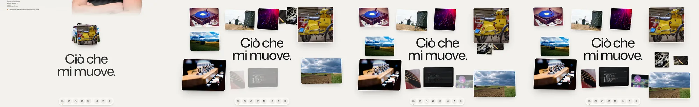

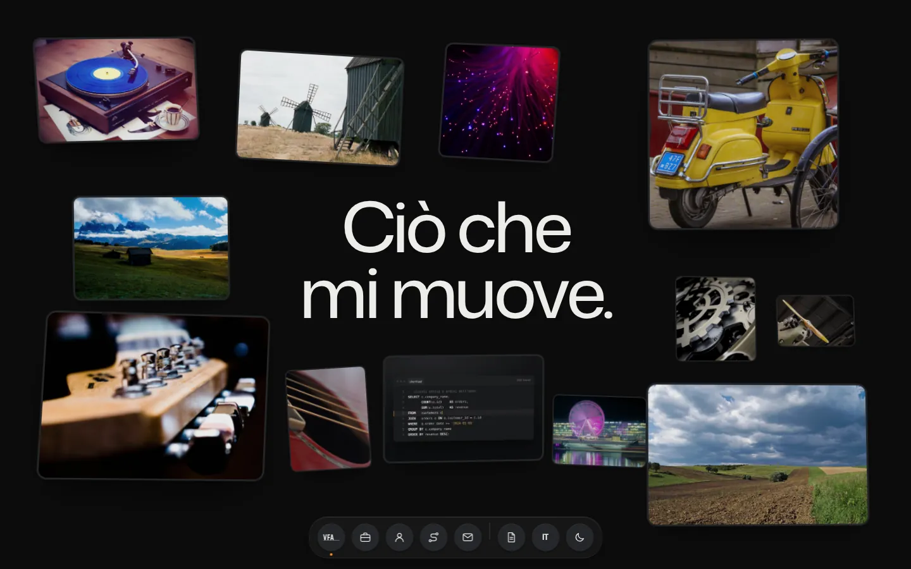

### Draggable Bento

The "At a glance" cards can be rearranged, and the feature says so: every card has a visible grip on its top edge and first-time visitors see a "Drag to rearrange" hint that disappears after the first interaction. Picking a card lifts it (scale, slight tilt, firmer shadow), the free slot is outlined where it will land, and the other cards slide out of the way with a FLIP animation. Mouse dragging starts after a few pixels; touch dragging starts after a short press on the grip, so page scrolling on phones is never hijacked. Keyboard: Alt + arrows, or Space to pick up, arrows to move, Space to drop, Esc to cancel, with every step announced via `aria-live`. The default composition stays curated; only the order of card ids is stored (`vfa:bento-order:v1`) and "Reset layout" lives in the section menu. Desktop, tablet and phone each have their own grid, and card internals respond to their real width through container queries.

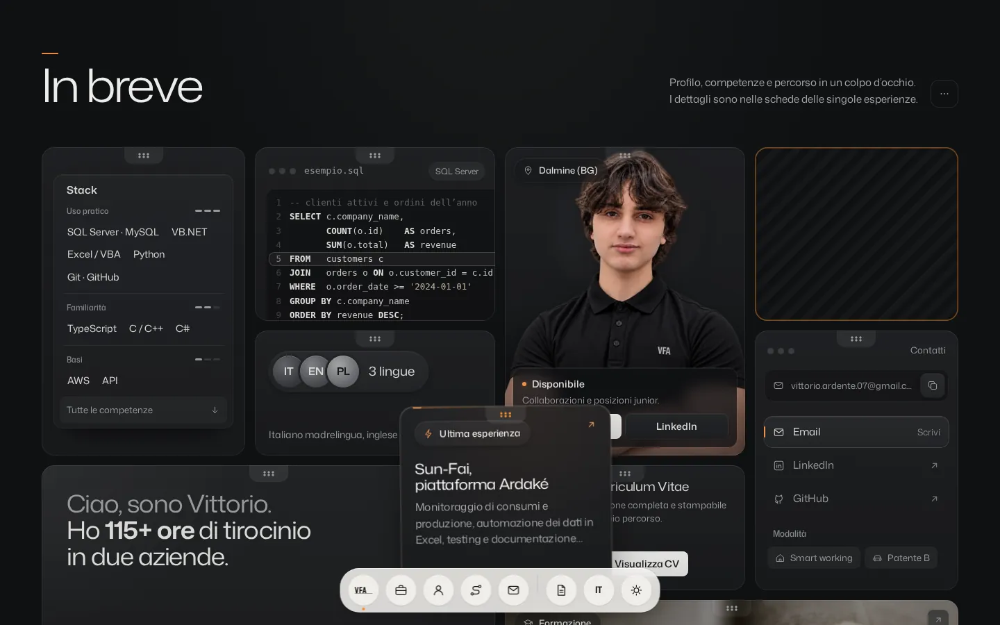

### Scroll-driven Timeline

"Journey" is its own section. On desktop it pins for 1.1 viewports while you scroll: the progress rail grows left to right, each milestone wakes up in sequence — the dot turns orange, then the year, the title and finally the detail panel, which lifts slightly with a contact shadow — the large year display changes with the active step, and the section releases after 2026. Past milestones stay readable, future ones are dimmed, so the story has a direction. The track is made of segments with a background ring around each dot, so it never runs through a marker. On tablets and phones it becomes a vertical story whose beam grows downwards as you read, without pinning. Milestones: 2021 start at ITI G. Marconi · 2024 internship at I.P.S. Informatica (40 h) · 2025 internship at Sun-Fai (75–80 h) · 2026 diploma, 94/100, first place at the CIVISUN school hackathon. GSAP ScrollTrigger is loaded only when the section approaches; `gsap.matchMedia` switches and cleans up the two modes; without JavaScript or with reduced motion the timeline is shown complete.

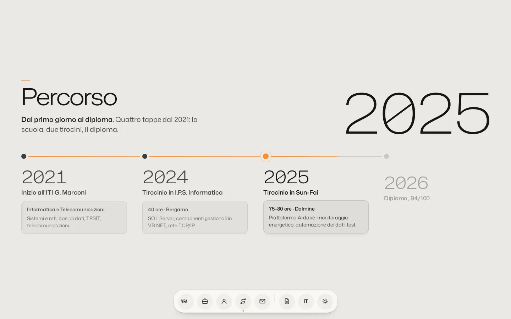

## Responsive Design

Layouts are designed per range (320–359, 360–479, 480–767, 768–899, 900–1199, 1200+), not shrunk. The hero keeps text and metadata in normal flow, so long Polish strings extend the section instead of colliding; the bento grid has 4, 3, 2 or 1 columns; the stack spread has its own positions on desktop, portrait tablet and phone; the timeline switches to vertical where horizontal labels would be cramped; the navigation becomes a touch bottom bar on phones. There is no horizontal page overflow, heights are content-driven, and `svh` units and safe areas are respected. An automated check runs 22 viewports (320×568 to 1920×1080, including 744×1133, 768×1024, 810×1080, 820×1180, 834×1194, 1024×1366 and phone/tablet landscape) in all three languages, testing page overflow, text escaping or clipped inside cards, hero overlaps, Dock bounds, touch-target size and truncated labels.

<p>
  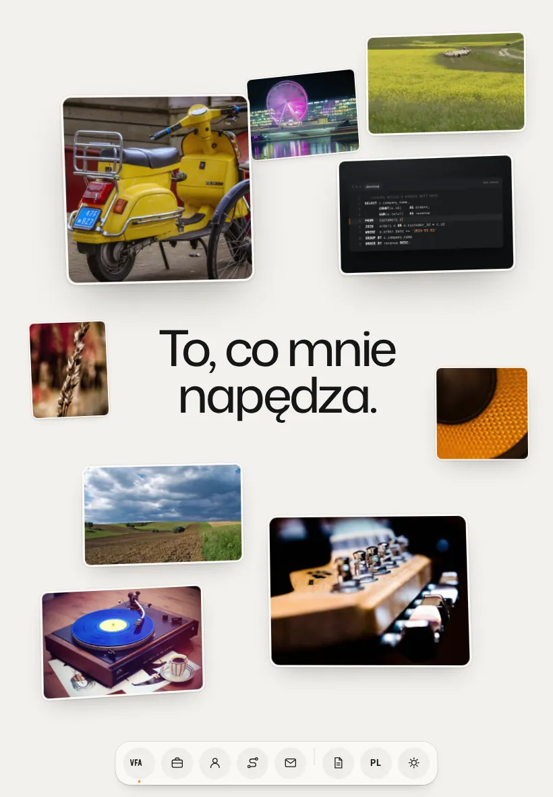
  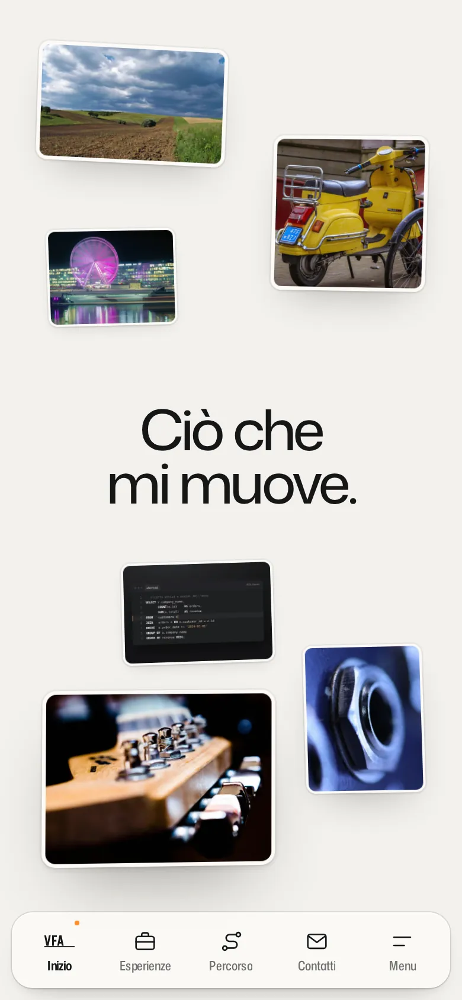
  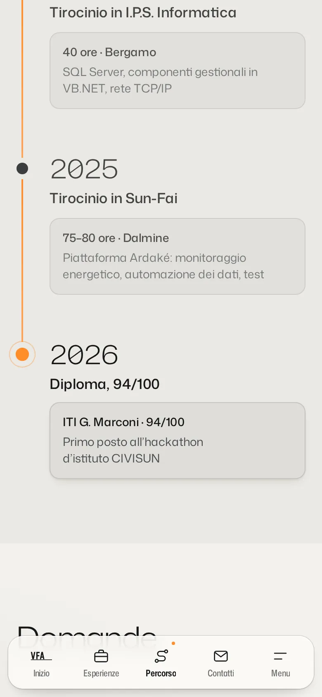
</p>

## Features

- **Dock navigation**, **stack spread of personal interests**, **draggable bento** and **scroll-driven timeline** (see above).
- **Three languages** — Italian (default, at the root), English under `/en`, Polish under `/pl`, with a remembered preference.
- **Light and dark themes**, each designed on its own palette.
- **Experience pages** for the two internships and the diploma, with a persistent way back.
- **Printable CV** at `/cv`, in the active language, light or dark, with a ready-made PDF.
- **Privacy** — no tracking, no cookies, no third-party requests: fonts, images and scripts are served by the site.

## Screenshots

| | |
|---|---|
|  | 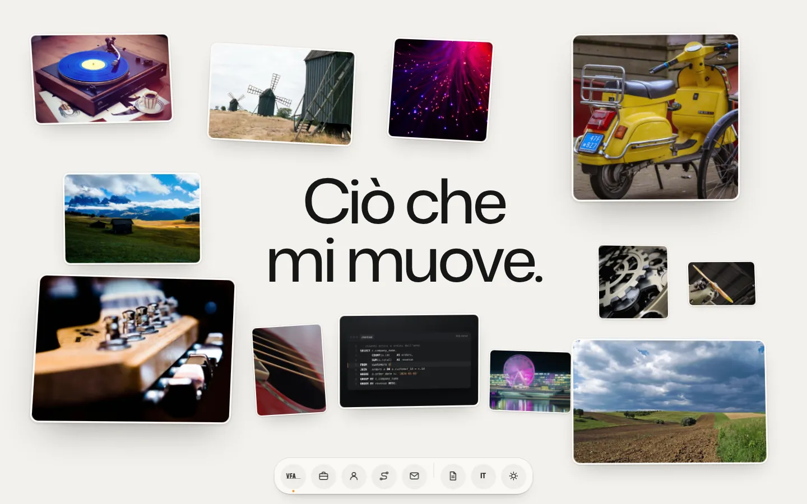 |
|  | 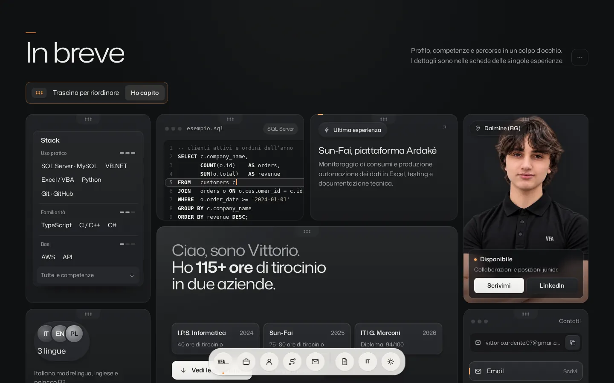 |
|  |  |
|  |  |

All screenshots are real captures of the production build (`docs/images/`).

## Technologies

Astro 7 (static output) · TypeScript (strict) · modern CSS (custom properties, Grid, container queries, `clip-path`, 3D transforms) · GSAP 3.15 + ScrollTrigger (Journey only, lazy-loaded) · native browser APIs (IntersectionObserver, ResizeObserver, Web Animations, `Intl`) · GitHub Actions.

### Implementation choices

No new library was added in the latest pass: the 3D depth uses native CSS 3D transforms (`perspective`, `translateZ`, `rotateX/Y/Z`) driven by one `requestAnimationFrame` loop that runs only while the section is visible and something moves; Three.js/WebGL was not needed for flat photographs in space. The recommended stack was Motion for the Dock and the Stack Spread, and React + dnd-kit for the Bento. They were evaluated and deliberately not used: the site ships a strict Content Security Policy without inline styles (checked on every build by `scripts/postbuild.mjs`), and Astro React islands inject inline styles and style attributes. The behaviours were therefore reimplemented without dependencies — a spring solver with the reference values for the Dock, a scroll-progress controller with damped smoothing for the Stack Spread (the same `useScroll` → `useTransform` model as the Hyperiux component), a pointer/touch/keyboard sortable for the Bento — and the site keeps zero hydration cost. Lenis was not added because native scrolling and ScrollTrigger pinning are the only scroll authority.

## Languages

Every page is generated in Italian, English and Polish with its own metadata, canonical URL and `hreflang` links. All visible strings — including Dock labels, drag hints, sorting announcements and timeline details — live in `src/i18n/locales/{it,en,pl}.json`. Polish is the stress test for long strings.

## Accessibility

The language (IT · EN · PL) and theme controls are real links and buttons in the top bar, the Dock and the menu, driven by one state each (the URL for the language, the root `data-theme` for the theme), with invisible hit areas of 40–45 px and restrained hover and focus states. Dock items are real links and buttons, keyboard reachable, with visible focus and labels shown on focus; the phone bar has labelled 44 px+ targets. The timeline is a semantic `<ol>` with `<time>` elements. In “What moves me” the title is real text and a visually hidden sentence lists the subjects of the photographs, which are otherwise decorative (`alt=""`, `aria-hidden`); nothing is available only on hover. The bento can be reordered from the keyboard and every move is announced. `prefers-reduced-motion` shows the finished stack spread without scroll choreography, switches the navigation instantly and disables magnification, shows the timeline complete, keeps drag-and-drop with minimal reflow animation, and disables the opening animation and idle mode.

## Structure

```
.github/workflows/   deploy.yml (build + GitHub Pages), build.yml (pull requests)
docs/                images/ (README screenshots)
public/              favicon, manifest, Open Graph image, CV PDFs, images/passions/ (16 photographs × 2 sizes × AVIF/WebP)
scripts/             postbuild (CSP headers, sitemap), passion-images, favicons, CV export, release check
src/
  components/        Header (bar + Dock), Hero, Passions, Bento, Experiences, Profile, Journey, Faq, Contact…
  data/              verified facts: profile, experiences, skills, places, credits.json
  i18n/              locale configuration and it / en / pl dictionaries
  layouts/           Base (head, metadata, hreflang) and Legal
  pages/             [...locale]/ → home, experience pages, cv, legal pages, credits, 404
  scripts/           nav.ts (bar → Dock, magnification, section spy), passions.ts (stack spread), bento.ts, timeline.ts (GSAP)…
  styles/            design tokens and base styles
```

## Development

```bash
npm ci
npm run dev        # http://localhost:4321
```

Node 22 is required (see `.nvmrc`). To add a photograph to “What moves me” (for example your own photo of a tractor), run `node scripts/passion-images.mjs <photo> <id> <4:5|4:3|3:2|1:1|16:10> [fx fy zoom]` (it writes AVIF and WebP at two sizes and prints the real dimensions), add its credits and dimensions to `src/data/credits.json`, add the id to `stackOrder` in `src/data/passions.ts` and list it, with a size family (L/M/S), in the layouts where it should appear. Positions are generated automatically; change a layout's `seed` to try another composition.

## Build

```bash
npm run build           # astro check + static build + CSP headers + sitemap
npm run preview
npm run build:release   # build + release completeness check (docs, credits, photographs)
```

## GitHub Pages Deployment

Repository: `Vittorio-Francesco-Ardente.github.io` (user site, no base path). Pushing to `main` — or running the workflow manually — triggers `.github/workflows/deploy.yml`, which installs with `npm ci`, builds and publishes `dist/` to GitHub Pages. In the repository settings set **Pages → Source → GitHub Actions**. Deployment runs automatically through GitHub Actions.

## Visual Credits

The portrait, the collage and the code screen in “What moves me” are the author's own. The other photographs are by third parties under CC0, CC BY 2.0/4.0 or CC BY-SA 2.0/3.0/4.0 terms; they are stored locally and listed with author, source, licence, date and changes in **[CREDITS.md](CREDITS.md)**, in `src/data/credits.json` and on the site's credits page.

## Third-party Credits

Mona Sans (GitHub, SIL OFL 1.1) and GSAP 3.15 with ScrollTrigger (GreenSock, GSAP Standard "No Charge" License). Interaction references — ibelick's Dock (motion-primitives, MIT), Hyperiux Vault's Stack Spread (MIT), Carolina Raulino's sortable bento, Hyperiux's scroll timelines — were reimplemented, not copied; see [THIRD_PARTY_NOTICES.md](THIRD_PARTY_NOTICES.md).

## Author

**Vittorio Francesco Ardente** — junior software developer & IT technician, Dalmine (BG), Italy.
https://vittorio-francesco-ardente.github.io/ · https://www.linkedin.com/in/vittorio-ardente-812775388 · https://github.com/Vittorio-Francesco-Ardente
